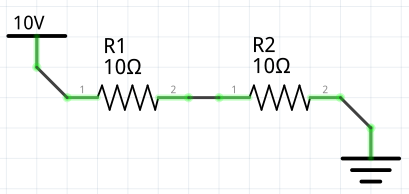

# dot format

We're using dot files as one of the import functions for a circuit schematic.

There are two parts: components and nodes.

Components are represented by lines, nodes are represented by the actual nodes in the graph.

An example set of nodes may look like this:

```
0 [label=VoltageNode, voltage=1.32]
1 [label=VoltageNode, voltage=4.53]
null [label=null]
```

.. and an example set of components may look like this:

```
0 -- 1 [label=Resistor, ohms=100]
```

## Example

This graph here:

```
graph subsystem0 {
    null [label=null]
    0 [label=Nod3]
    1 [label=Nod3]
    2 [label=Nod3]
    0 -- null [label=VoltageSource volts=10]
    0 -- 1 [label=Resistor ohms=10]
    1 -- 2 [label=Resistor ohms=10]
    2 -- null [label=VoltageSource volts=0]
}
```

...represents a circuit like this:



## Node Types

You can have the following node types:

* null (not connected?)
* Nod3 (a basic connection) - uses a `3` instead of an `e`, becuase `Node` is a reserved word

## Component Types

You can have the following component types (and they have properties as follows):

* Resistor (takes `ohms` as a property)
* Inductor (takes `henries` as a property)
* Capacitor (takes `farads` as a property)
* VoltageSource (takes `volts` as a property) (a basic connection point)